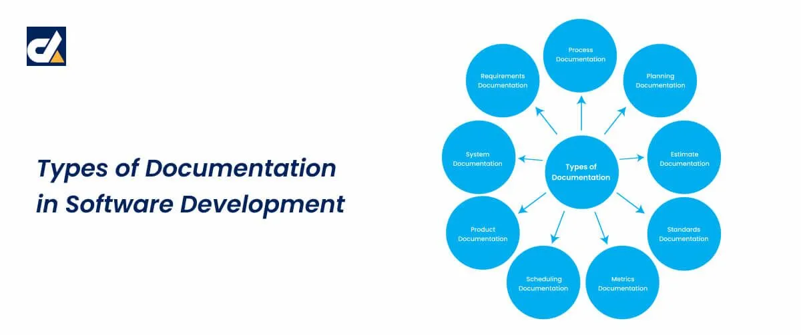
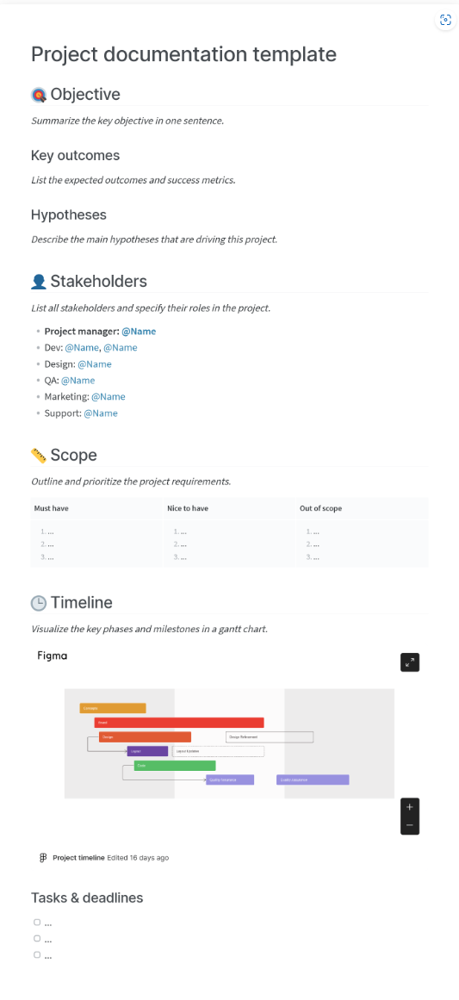
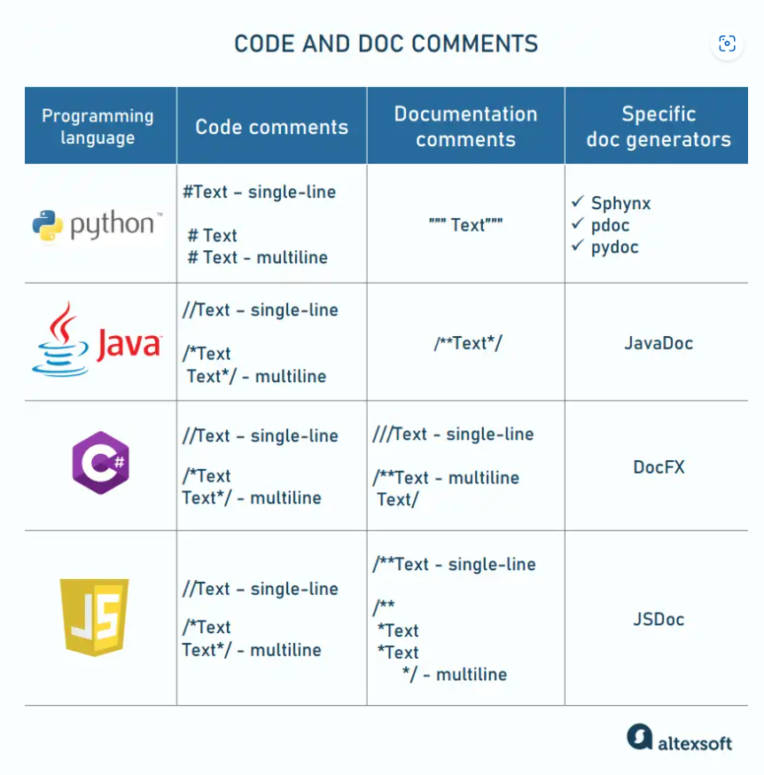
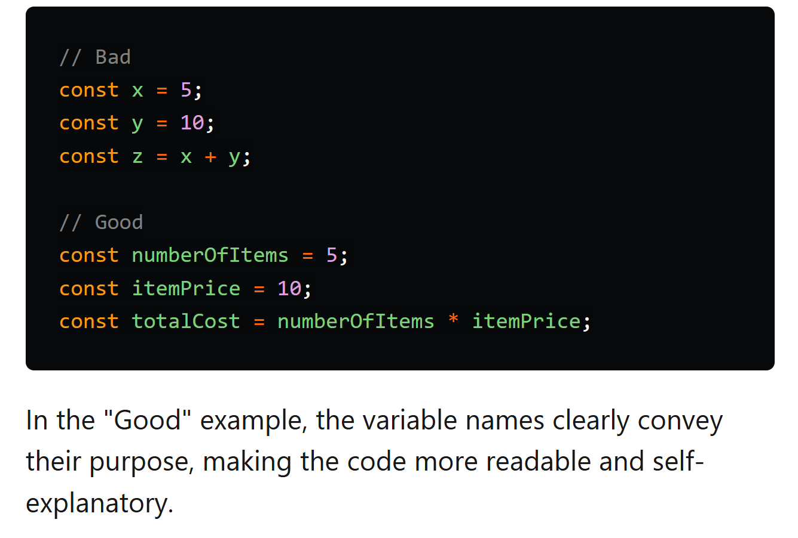
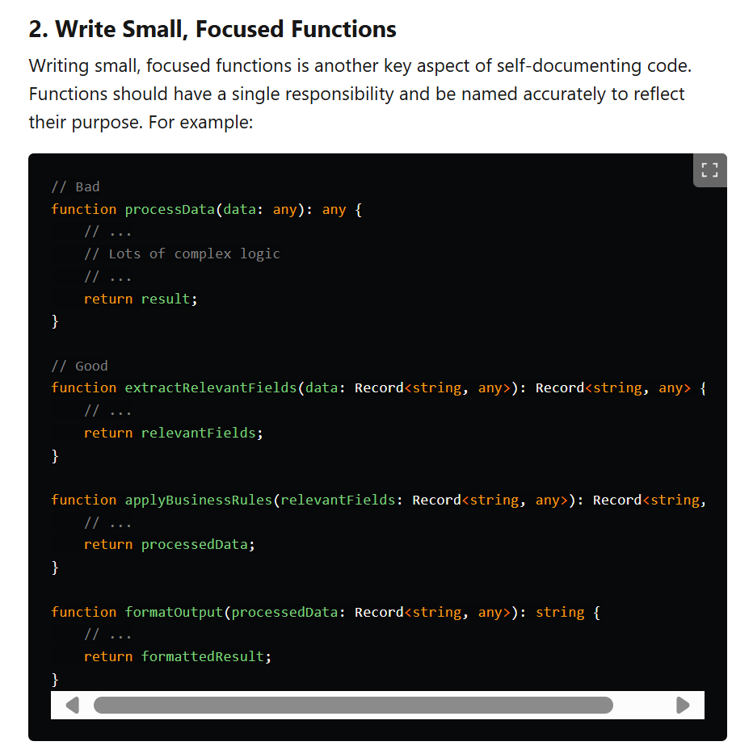
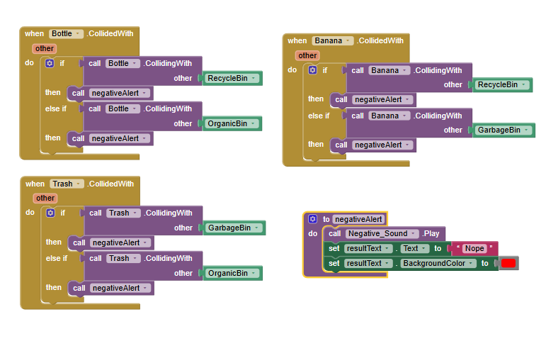

# dgl104-programming-article-repo

# Documentation Purpose & Processes:

## Introduction: 
What is the article about? 
This article is about the documentation related to writing programs and working in a team environment. We will speak about the different types of documentation, what documentation is, and what is the purpose of documentation. The article will include what are some good practices when documenting, and coding. The goal of this article is to provide an easily understood overall view of what documentation is, and why it is important. 

## What is documentation? 
Documentation is a method of recording information, that should be kept for efficiency and communication purposes. The information is essential to help future readers understand the historical past and easily maintain, understand, or manage, a specific point in a project. Documentation is the “The use of historical documents” (Marriam-Webster.com).

## The importance of documentation:
When working on a project it is important to document the process, and steps taken, to help create a quality program, or project. Documentation improves the maintenance, collaboration of the team, and efficiency. One major benefit of the is that is decreases the chances of the project failing. If the documentation is consistent and understood, it may prevent future bugs from being introduced. Documentation is a form of communication, and communication is a core asset to building a project. In an online article a writer asserts that “documentation helps developers understand the codebase” (The Tech Insider).

## Types of documentation:
 

**There are many types of software documentation as shown in the image above.** 

### To list a few: 
-	Process Documentation
-	Planning Documentation
-	Estimate Documentation
-	Standards Documentation
-	Metrics Documentation
-	Scheduling Documentation
-	Product Documentation
-	System Documentation 
-	Requirements Documentation
-	Project level Documentation 
-	Code level Documentation
-	Self Documenting Code

### In this article we will be speaking about:
-	Project level Documentation 
-	Code level Documentation
-	Self Documenting Code

## Project Documentation: 
Project documentation is essential for effectively communicating the progress and outcomes of a project, as it involves recording completed work at strategic points. This documentation serves several purposes including providing information about the projects plans and outcomes, speaking about the specific code created issues that may have been encountered, and any ideas that could improve the project. The project documentation explains the purpose of the functions, any test results, and why the function is designed a certain way. This type of documentation speaks to both the stake holders, and the team members who are working on the project, who may not have much coding experience. The team can be involved in the process and reflect the project goals and objectives, by being capable of understanding the project documentation. Project documentation is a great way to track the progress of the project and add revisions. Project documentation, improves communication, decision making, and acts as a historical reference, assists in mitigating the risks, and ensures quality control can be effective. A supporting article online states that, “Effective project documentation is key to successful project management. It serves as a central place for important information, helps in making decisions, and ensures good communication and project continuity.” (www.geeksforgeeks.org 09 Aug. 2024)

**Here is a example of what a template might look like for "Project Level Documentation**

### Key take away:
-	Good for communication. 
-	Records historical data at strategic points.
-	Communicates ideas, issues, goals, and structures, objectives, progress.
-	Is understood by stakeholders, and team members/ management.
-	Explains the purpose of functions in a simple language.
-	Speaks about test results.
-	Explains design.
-	Helps with decision making. 
-	Mitigates risks of failure.
-	Acts as a tool for quality improvement, and control. 
-	Helps with the planning process of the project. 

## Code Level Documentation: 
Code level documentation is a practice of communication between programmers in the back end and the documentation comments can be built into the code, “Documentation can take many forms, including code comments” (The Tech Insider).  This type of code may include explanations of functions, “TODO”, lists, revisions made, or just for historical reference.  The documentation assists the programmers in communicating the more technical aspects of the code, which would me difficult for nonprogrammers to understand. It would speak about files, and functions, elements, and ideas, bugs, and tests done. In many cases, programmers will be working on the same project from different locations, the “code level documentation”, allows the programmers to hand off the project seamlessly to one another. A benefit of this type of coding would be that it could serve as a reminder of what has been done, or what needs to be done. 

### Potential Issues of Code Level Documentation:
-	If the documentation is not maintained, or deleted as needed later the documentation may no longer be relevant, and cause confusion. 
-	This documentation needs to be manually altered or removed. 
-	Typos, or errors, may cause syntax errors. 

**How to comment in different code languages**

## Best practices of documentation:
Following the best practices helps your project be successful in reaching its goals and reduces the savings of time. If done properly the documentation created can become a valuable resource in development.  
Best practices of documenting include: 
-	Writing clear and concise documentation. 
-	Avoid technical Jargon.
-	Keep the documentation on target.
-	Keep it short.
-	Be consistent, it is easier to understand when consistent.
-	Explain what the code does. 
-	Explain why it was implemented.
-	Provide examples to demonstrate functionality.
-	Good grammar helps with understanding. 
-	View code documentation as a living, evolving document.
-	Make documentation a daily or weekly part of your workflow.
-	Be proactive.
-	Code documentation should reflect the related code, and its functionality.
**Note: Outdated documentation can become a big problem because it can mislead others and contribute to creating errors in the future.**

## Self Documentation code:

Self documenting code is the practice of following good naming conventions, and organization of the code written If done correctly, the code will be easily understood by others who are reading it. The code will become simple to manage, mentioned in an online article, “your codebase is easy to understand” (TECHNOLOGIES July 30th, 2019). As a result, the code will be easier to maintain, costing less time and money. This reduces the need for programmers to look at the written documentation, as it is easily understood. A good programmer will adopt this habit and integrate this into the programming routine.  The main defence against bugs is good programming practice and naming conventions. Writing simple modular code functions will help to create “Self Documenting Code”. 

**Here are some images of self documenting code examples.**

**Example of creating modular code with MIT App Inventor.**

### Key take away: 
-	Use good naming conventions. 
-	Be organized.
-	Use white space effectively.
-	Make “Self Documenting Code”, a habit.
-	Create simple modular code functions.

## Conclusion:
In conclusion, when developing a program and working with a team, the process of documentation is essential. The team will work more efficiently, and many issues can be avoided when using good documentation practices. The projects will flow more smoothly, and the code will be easier to read. Directional choices from the leading team members will be easier to make, as they will have the information needed to create a plan.  Collaboration with fellow colleagues will effectively improve. Productivity will increase, and targets will be met, minimizing the bugs, and communication problems. Things run a lot more smoothly when a team can communicate effectively, so make it a habit, and adopt good documentation practices. 

## References:

